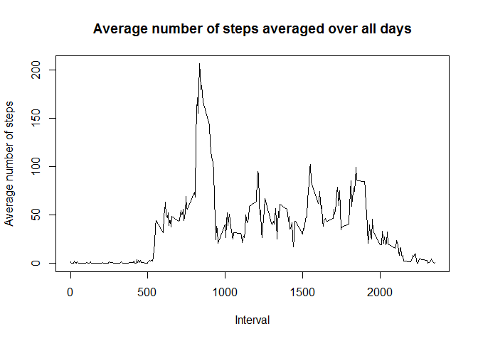

# Reproducible Research: Peer Assessment 1
Chad Naujoks
## Loading and preprocessing the data
Here we are going to make sure the zip file is downloaded and unzipped.  
Then we are going to read the CSV into a dataset.  
Once the data has been read in we are going to update the Date field to be a Posix date type so we can do various analytics based on day of week if need be.

```r
if (!file.exists("activity.zip"))
{
  download.file("http://d396qusza40orc.cloudfront.net/repdata%2Fdata%2Factivity.zip", "activity.zip")
  unzip("activity.zip")
} 
if (!file.exists("activity.csv"))
{ 
  unzip("activity.zip")
}

activityDS <- read.csv("activity.csv")
activityDS$date <- as.Date(activityDS$date, "%Y-%m-%d")
```


## What is mean total number of steps taken per day?
We need to show the average number of steps for each day in the dataset. (ignoring NA's)
- get rid of the NA's
- sum the number of steps each day
- show a histoogram of the total steps in a day
- show the mean and then the median of steps per day

```r
#get rid of the NA's in the dataset
activityDS_NA <- na.omit(activityDS)

#sum all steps by day
steps_day <- aggregate(steps ~ date, activityDS_NA, sum)

#create a histogram of the Steps / day
hist(steps_day$steps, breaks=5, col=2, main="Histogram of Total Steps per Day", xlab="Steps / Day")
```

 

```r
#show the mean  steps / day
mean(steps_day$steps)
```

```
## [1] 10766.19
```

```r
#show the median steps / day
median(steps_day$steps)
```

```
## [1] 10765
```


## What is the average daily activity pattern?


```r
# get the average number of steps / interval across all days
steps_interval <- aggregate(steps ~ interval, activityDS_NA, mean)

# create a line chart showing the average number of steps for each interval across all days
plot(steps_interval$interval, steps_interval$steps, type='l', col=1, 
     main="Average number of steps averaged over all days", xlab="Interval", 
     ylab="Average number of steps")
```

 

```r
# find row id of maximum average number of steps in an interval
max_steps_row <- which.max(steps_interval$steps)

# get the interval with maximum average number of steps in an interval
steps_interval [max_steps_row, ]
```

```
##     interval    steps
## 104      835 206.1698
```
The data shows that the interval **835** has the highest average number of steps which was **206.1698113**

## Imputing missing values
Note that there are a number of days/intervals where there are missing values (coded as NA). The presence of missing days may introduce bias into some calculations or summaries of the data.

1. Figure out the number of entries that are not complete and show the count (rows that have NA)

2. Use the mean/median for the day or interval to fill in the missing data

3. Create a new dataset that has the missing data filled in using the mean or median

4. Make a histogram of the total number of steps taken each day and Calculate and report the mean and median total number of steps taken per day. 

Do these values differ from the estimates from the first part of the assignment? What is the impact of imputing missing data on the estimates of the total daily number of steps?

```r
# get the rows that are not complete (have NAs)
activityDS_NAs <- activityDS[!complete.cases(activityDS),]

# show the count of the rows that have missing data
nrow(activityDS_NAs)
```

```
## [1] 2304
```
The number of rows with missing data is **2304**.

To perform the imputation, we need to use the data from our previous dataset that has the 5-minute interval means (steps_interval above).

```r
# Loop through the original dataset
for (i in 1:nrow(activityDS))
{
  #if the row has an NA in the steps place
  if (is.na(activityDS$steps[i]))
  {
    #get the interval ID for that row
    interval_id <- activityDS$interval[i]
    #get the rowID for that interval ID from the interval mean table (steps interval)
    row_id <- which(steps_interval$interval == interval_id)
    #get the value of the mean for that interval mean
    step_count <- steps_interval$steps[row_id]
    #over write the NA with the mean for the interval
    activityDS$steps[i] <- step_count
  }
}

# sum steps / day
sum_steps_imputed_day <- aggregate(steps ~ date, activityDS, sum)

# create histogram of total number of steps / day
hist(sum_steps_imputed_day$steps, col=1, main="Total number of steps / day", xlab="Total number of steps / day")
```

 

```r
# get mean and median of total number of steps / day
mean(sum_steps_imputed_day$steps)
```

```
## [1] 10766.19
```

```r
median(sum_steps_imputed_day$steps)
```

```
## [1] 10766.19
```

```r
# get mean and median of total number of steps / day for data with NA's removed
mean(steps_day$steps)
```

```
## [1] 10766.19
```

```r
median(steps_day$steps)
```

```
## [1] 10765
```
After replacing NAs with the Mean for the Interval, the means will stay the same:   
-Original (NAs Removed): **10,766.19**  
-Imputed (NAs Replaced): **10,766.19** 

The median value changes slightly:  
-Original (NAs Removed): **10,765**  
-Imputed (NAs Replaced): **10,766.19**


## Are there differences in activity patterns between weekdays and weekends?

1. Create a new column indicating if the day is a weekday or weekend

2. Create a plot showing the interval and average number of steps taken across weekdays vs weekends

```r
# add a new column containing the day of the week
activityDS$day <- weekdays(activityDS$date)

# add a new column to hold the day type (weekday or weekend)
activityDS$daytype <- c("weekday")

# set the daytype = weekend for Saturday or Sunday
for (i in 1:nrow(activityDS)){
  if (activityDS$day[i] == "Saturday" || activityDS$day[i] == "Sunday"){
    activityDS$daytype[i] <- "weekend"
  }
}

# convert daytype to a factor
activityDS$daytype <- as.factor(activityDS$daytype)

# get the average number of steps across the intervals by daytype
averageSteps_DayType <- aggregate(steps ~ interval+daytype, activityDS, mean)

# make the panel plot for weekdays and weekends
library(ggplot2)

qplot(interval, steps, data=averageSteps_DayType , geom=c("line"), xlab="Interval", 
      ylab="Number of steps", main="") + facet_wrap(~ daytype, ncol=1)
```

 

Clean up memory


```r
# remove the data frames to free memory
rm(activityDS, activityDS_NA, activityDS_NAs, steps_day, steps_interval, sum_steps_imputed_day, averageSteps_DayType, max_steps_row, averageSteps_DayType)
```

```
## Warning in rm(activityDS, activityDS_NA, activityDS_NAs, steps_day,
## steps_interval, : object 'averageSteps_DayType' not found
```
